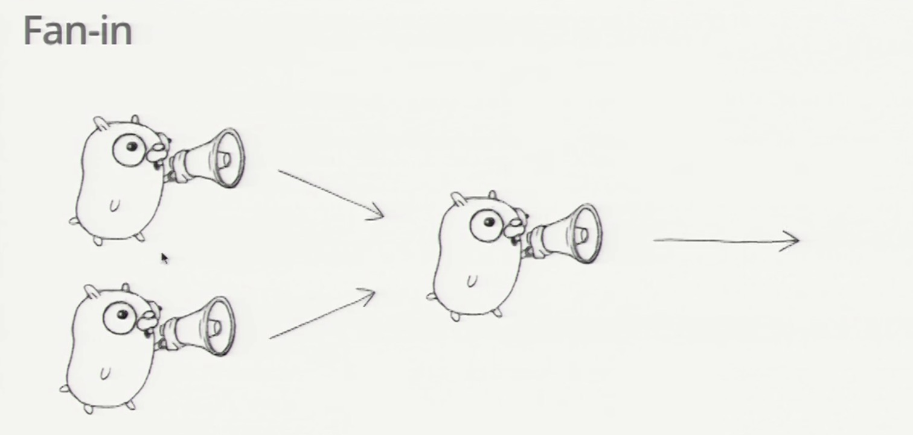

### Here is the **video**

[Go Concurrency Patterns](https://www.youtube.com/watch?v=f6kdp27TYZs)

### Here is some pic

#### [boring-04.go](boring-04/boring-04.go)



```go
func fanIn(input1, input2 <-chan string) <-chan string {
	c := make(chan string)
	go func() {
		for {
			c <- <-input1
		}
	}()
	go func() {
		for {
			c <- <-input2
		}
	}()
	return c
}
```
